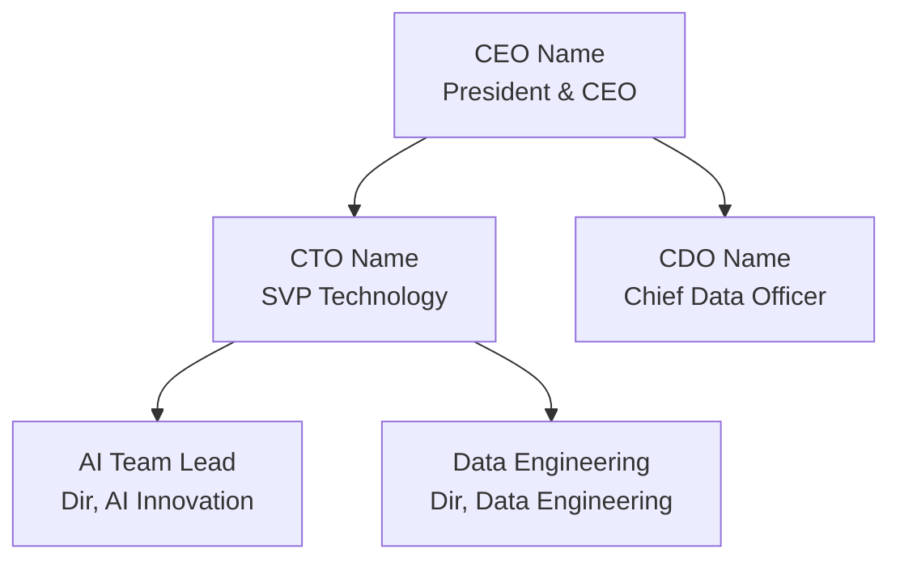

# Account Dossier — Narrative Intelligence Package

Produce a narrative account dossier that gets someone up to speed on a client relationship in 20 minutes. This is NOT a data dump — it's a *story* with sourced claims, named people, and actionable guidance.

**Exemplar output:** `project/{Company}/intel/account-story.md`

**Quality bar:** Output must be Chief of Staff level — decision-ready, specific, no filler, named people and sourced claims over generic summary.

---

## Output Files

Every dossier produces **2 files**:

1. **Main Dossier** — `project/{Company}/intel/account-story.md`
   - 20-minute narrative read
   - All chapters below
   - Every major claim sourced (SF data, transcript quote, research URL)

2. **Relationship Map** — `project/{Company}/intel/relationship-map.md`
   - Client org chart (decision-making dynamics, not just titles)
   - Tavant relationship map (who-talks-to-whom, trust levels)
   - Key contacts with context (what they care about, communication style)
   - Stakeholder influence grid (power × interest)
   - Visual Mermaid diagrams for quick scanning

---

## Dossier Structure (14 Chapters)

### Chapter 1: How We Got Here (Origin → Present)
Year-by-year narrative from first engagement to present. Not just revenue — inflection points, model shifts, people changes. Should answer: "What kind of relationship was this, and how did it evolve?"

**Sources:** Salesforce deal history, Notion meeting transcripts, internal strategy docs

**Must include:**
- First deal (date, size, model, who sold it)
- Each major model shift (staff-aug → SOW → strategic partner)
- Named people at each inflection
- Revenue trajectory with actual numbers

### Chapter 2: The Current State (Scale & Scope)
What the engagement looks like TODAY — size, breadth, active workstreams, team composition.

**Sources:** Salesforce open opportunities, Notion recent meetings, delivery team data

**Must include:**
- Total headcount deployed (onshore/offshore/nearshore split)
- Active workstreams with $ values
- Revenue run-rate and target
- Current engagement model

### Chapter 3: How Deals Get Won (Sales Pattern Intelligence)
The actual mechanics of closing deals at this specific account. Not generic sales advice — evidence-based from past wins.

**Sources:** Salesforce win history (timing, size, pattern), Notion strategy meetings, internal discussions

**Must include:**
- The renewal/procurement cycle (timing, who approves, batch vs. individual)
- Pricing dynamics (rate card evolution, BOOT/managed services models)
- What internal champions say about why Tavant wins
- Quid pro quo dynamics — what the client expects beyond delivery
- Common deal sizes and how to size new opportunities

### Chapter 4: Losses & Lessons
What went wrong and what we learned. Frank assessment.

**Sources:** Salesforce lost deals, Notion post-mortems or strategy meetings referencing losses

**Must include:**
- Each significant loss: who won, why, what we could have done differently
- Patterns in losses (timing, capability gap, pricing, relationship)
- How losses changed subsequent strategy

### Chapter 5: People & Politics Map (Summary — Full Map in Separate File)
Quick-reference overview of the key players. Points to the full relationship-map.md for details.

**Sources:** Salesforce contacts, Notion meeting attendees, LinkedIn, internal relationship notes

**Must include:**
- Client decision-makers (CTO, CPO, CDO, CEO) with mandate/priorities
- Tavant relationship owners and their access level
- Political dynamics (who champions us, who's neutral, who's a risk)
- The "Frankenaccount" complexity explained (if applicable)

### Chapter 6: What the Client Values Most
Evidence-based (from behavior, renewals, feedback) — NOT assumptions about what they "should" value.

**Sources:** Renewal patterns, Notion meeting quotes, performance reviews, expansion triggers

**Must include:**
- Top 3 value drivers (ranked by evidence strength)
- What causes renewals vs. what causes them to look elsewhere
- Specific quotes from client-side stakeholders about Tavant's value
- Unspoken expectations (gleaned from behavior, not stated directly)

### Chapter 7: AI & Data Technology Stack
What AI/ML/Data platforms and tools the client uses, how mature they are, where the gaps live.

**Sources:** Web research (tech blogs, job postings, conference talks), Notion technical meetings, Salesforce notes, LinkedIn hires

**Must include:**
- AI/ML platforms and frameworks (cloud provider, model serving, MLOps)
- Data infrastructure (warehouse, lakehouse, streaming, ETL)
- AI governance posture (guardrails, eval, model registry, cost management)
- Internal AI products (what they've built, maturity level)
- AI team structure (size, reporting line, recent hires, mandate)
- Key technology decisions in flight

**Format:**
```markdown
| Layer | Tool/Platform | Maturity | Evidence |
|-------|--------------|----------|----------|
| Model Serving | [e.g., SageMaker, Bedrock, custom] | [Production/POC/Planned] | [source] |
| MLOps | ... | ... | ... |
| Data Warehouse | ... | ... | ... |
| Governance | ... | ... | ... |
| Cost Management | ... | ... | ... |
```

### Chapter 8: AI News, Initiatives & Commentary
A living feed of AI-related signals from and about the client — public announcements, job postings, conference talks, patent filings, executive comments.

**Sources:** Web search (news, press releases, blogs), LinkedIn activity, conference presentations, patent databases, Notion meeting notes where AI strategy is discussed

**Must include:**
- Public AI announcements (product launches, partnerships, patents)
- Executive commentary on AI (earnings calls, interviews, conference panels)
- AI-related job postings (what they're hiring for = what they're building)
- Internal AI initiatives mentioned in meetings (even if not public)
- AI vendor relationships (who else they work with — competitors or complementary)
- Sentiment analysis: are they AI-bullish, cautious, or reactive?

**Format:**
```markdown
### AI Signal Timeline
| Date | Signal | Source | Implications |
|------|--------|--------|--------------|
| 2026-03 | Hired Head of AI Platform | LinkedIn | Building dedicated AI infra team |
| 2026-01 | Launched NL search feature | Press release | Investing in consumer-facing AI |
| ... | ... | ... | ... |

### AI Posture Assessment
- **Investment level:** [Heavy / Moderate / Exploratory / Reactive]
- **Decision-maker mandate:** [CTO says "..." about AI]
- **Build vs. buy tendency:** [Build / Buy / Hybrid — with evidence]
- **Governance maturity:** [Ad-hoc / Framework / Embedded / Regulated]
```

### Chapter 9: Big Initiatives & Strategic Bets
The 3-5 largest things the client is doing right now — technology, business, or organizational transformations that create opportunity or risk for Tavant.

**Sources:** Notion meeting transcripts, web research (press releases, earnings calls), Salesforce opportunity notes

**Must include:**
- Each initiative: what it is, who owns it, timeline, budget (if known)
- Why the initiative exists (regulatory, competitive, cost, growth)
- Where Tavant fits (already involved, positioned, or locked out)
- Initiative interdependencies (which ones feed each other)
- Risk to Tavant if initiative succeeds/fails/changes direction

### Chapter 10: Competitive Landscape
Who else is in the account, what they do, and where they threaten Tavant's position.

**Sources:** Salesforce lost deals, Notion strategy meetings, web research (vendor announcements), job postings

**Must include:**
- Named competitors with specific scope (not just company names — WHAT they do at this client)
- How they entered (which door, which champion)
- Where they're stronger/weaker than Tavant
- Displacement risk assessment for each
- Competitive strategy (how to defend, where to attack)

### Chapter 11: Industry Landscape
Where does this client sit in their market? What macro forces affect them? What does the competitive/regulatory environment look like?

**Sources:** Industry reports, earnings calls, market data, analyst coverage, news

**Must include:**
- Market position scoreboard (vs. direct competitors with metrics)
- Parent company context (if subsidiary — strategic priorities, constraints)
- Industry trends that create urgency or opportunity
- Regulatory environment (upcoming changes, compliance pressure)
- What this all means for Tavant's engagement strategy

### Chapter 12: Strategic Risks & Opportunities (Forward-Looking)
The "so what" — risks to manage and opportunities to pursue in the next 6-12 months.

**Sources:** Synthesis of all prior chapters

**Must include:**
- Top 3 risks (revenue cliff, competitive displacement, relationship change) with mitigation
- Top 3 opportunities (whitespace, expansion, new capability) with approach
- The whale deal (if one exists) — what's required to land it
- Budget cycle timing and how to align
- **TAM Analysis (Total Addressable Market within the account)** — required structured section

**TAM Format (required):**
```markdown
### TAM — Addressable Market Within {Company}

| Timeframe | Conservative | Base Case | Aggressive | Assumptions |
|-----------|-------------|-----------|------------|-------------|
| Current run-rate | $X/yr | — | — | Contracted + active pipeline |
| 12-month | $X | $X | $X | [what must happen for each] |
| 24-month | $X | $X | $X | [what must happen for each] |
| 36-month (full potential) | $X | $X | $X | [what must happen for each] |

**TAM Decomposition:**
| Capability Lane | Current Spend | Addressable | Probability | Weighted |
|----------------|--------------|-------------|-------------|----------|
| [e.g., App Dev] | $X | $X | X% | $X |
| [e.g., AI/ML] | $X | $X | X% | $X |
| [e.g., Data Platform] | $X | $X | X% | $X |
| [e.g., Managed Services] | $X | $X | X% | $X |
| **Total** | **$X** | **$X** | — | **$X** |

**Key TAM drivers:**
- [What expands TAM — e.g., new business unit access, platform deal, M&A]
- [What contracts TAM — e.g., insourcing, budget cuts, competitive displacement]

**Evidence basis:** [Where these numbers come from — SF pipeline, internal citations, industry benchmarks, client IT spend as % of revenue]
```

**TAM calculation guidance:**
- Use client's total IT/technology spend as the outer bound (typically 3-8% of revenue for enterprises)
- Narrow to addressable lanes where Tavant has credible capability + relationship access
- Weight by probability based on relationship strength, competitive position, and budget cycle timing
- Always cite the source: Salesforce pipeline data, internal meeting quotes, industry benchmarks, or public filings
- If client revenue is public (SEC filings), calculate IT spend range as sanity check

### Chapter 13: What I Wish I Knew Day 1
The insider perspective — things that aren't obvious from data but are critical to navigating the account. Written in first person by the most tenured team member's voice.

**Sources:** Notion meeting transcripts (look for candid internal discussions, frustrations, advice)

**Must include:**
- The #1 misconception newcomers have about this account
- The hidden rules (communication style, decision-making tempo, what offends)
- The "sacred cows" — things you must never suggest changing
- The fastest way to build credibility
- Who to align with first (and who to avoid until you've earned trust)

### Chapter 14: Your First 30 Days (Action Plan)
Concrete playbook for someone new to the account. Week-by-week with specific actions.

**Sources:** Synthesis of all prior chapters

**Format:**
```markdown
### Week 1: Orient
- [ ] Read [specific documents]
- [ ] Meet [specific people] — here's what to ask each one
- [ ] Understand [specific systems/tools]

### Week 2: Observe
- [ ] Shadow [specific meetings]
- [ ] Map [specific relationships]
- [ ] Identify [specific quick wins]

### Week 3: Contribute
- [ ] Deliver [specific value]
- [ ] Build credibility with [specific person]

### Week 4: Propose
- [ ] Present findings to [audience]
- [ ] Propose [specific next engagement]
```

---

## Relationship Map File Structure

The separate `relationship-map.md` file contains:

```markdown
# {Company} — Relationship & Org Map

## Client Organization Chart



[Always use mermaid graph TD for org charts — never plain text hierarchies]

## Decision-Making Dynamics
| Person | Title | Decides On | Influenced By | Communication Style | Trust Level (Tavant) |
|--------|-------|-----------|---------------|--------------------|--------------------|
| ... | ... | ... | ... | ... | Champion / Warm / Neutral / Cold |

## Stakeholder Influence Grid
```mermaid
quadrantChart
    title Stakeholder Map
    x-axis Low Influence --> High Influence
    y-axis Low Interest --> High Interest
    quadrant-1 Manage Closely
    quadrant-2 Keep Satisfied
    quadrant-3 Monitor
    quadrant-4 Keep Informed
    [Name]: [x, y]
```

## Tavant ↔ Client Relationship Lines
[Mermaid diagram: who on Tavant side talks to whom on client side, frequency, topic]

## Key Contacts — Deep Profiles

### {Name} — {Title}
- **Mandate:** What they're responsible for
- **Priorities (FY current):** Their top 3 goals
- **Pain points:** What frustrates them
- **Communication preference:** Email / Slack / Meeting / Informal
- **Relationship with Tavant:** History, trust level, any friction
- **What they value from vendors:** Speed? Quality? Innovation? Cost?
- **LinkedIn:** [link]
- **Last meaningful interaction:** [date + topic]

[Repeat for each key contact]

## New People to Engage
| Name | Title | Why They Matter | Entry Strategy | Owner |
|------|-------|----------------|----------------|-------|
| ... | ... | ... | ... | ... |

## Relationship Health Score
| Dimension | Score (1-5) | Evidence | Action if <3 |
|-----------|------------|---------|--------------|
| Executive access | | | |
| Technical trust | | | |
| Commercial alignment | | | |
| Innovation partnership | | | |
| Competitive moat | | | |
```

---

## Data Gathering Strategy

### Primary Sources (Always Check)

1. **Salesforce** — Deal history, contacts, opportunity notes, activity timeline
   - Query: all closed-won + closed-lost + open pipeline for the account
   - Extract: revenue by year, win/loss pattern, key contacts, deal descriptions

2. **Notion Meeting Transcripts** — The richest source for politics, strategy, and insider intel
   - Search: company name + key people names in meeting notes (last 6 months minimum)
   - Extract: quotes, decisions, frustrations, strategy discussions, relationship dynamics

3. **Web Research** — Industry context, AI signals, competitive intelligence
   - Company news (press releases, earnings, blog posts)
   - Job postings (what they're building = what they're hiring for)
   - Conference talks and patents (AI strategy signals)
   - Competitor announcements (who's entering their space)
   - Industry reports (market position, trends)

4. **Internal Documents** — Past proposals, QBR decks, strategy docs
   - Check: `project/{Company}/docs/`, SharePoint, Google Drive
   - Extract: prior analysis, relationship notes, delivery assessments

5. **LinkedIn** — People intelligence
   - New hires (especially AI/Data roles)
   - Executive posts about strategy
   - Team growth signals

6. **Microsoft Teams** (via Chrome DevTools MCP) — Channel conversations, strategy threads, delivery updates
   - Search Teams channels for company name, key people names, project names
   - Check: D Team channel, Tavant AI channel, account-specific channels
   - Extract: real-time delivery commentary, escalations, informal strategy discussions, client feedback shared internally
   - Method: Use Chrome DevTools MCP to navigate Teams web app, search messages, read threads

7. **Outlook Email** (via Chrome DevTools MCP) — Client correspondence, internal strategy threads, proposal exchanges
   - Search inbox/sent for company name, key contact names, deal names
   - Check: flagged emails, recent threads with client stakeholders, internal strategy threads
   - Extract: commitments made, timelines promised, pricing discussed, relationship tone, action items pending
   - Method: Use Chrome DevTools MCP to navigate Outlook web app, search messages, read email threads
   - Priority: Focus on emails from last 90 days; flag anything with pricing, timeline, or commitment language

### Source Priority by Chapter

| Chapter | Primary Source | Secondary | Tertiary |
|---------|--------------|-----------|----------|
| 1 (History) | Salesforce | Notion meetings | Internal docs |
| 2 (Current State) | Salesforce + Notion | Teams channels | Delivery data |
| 3 (Sales Patterns) | Notion meetings | Outlook (pricing/proposals) | Salesforce timing |
| 4 (Losses) | Salesforce | Notion post-mortems | Outlook (loss threads) |
| 5 (People) | Notion + LinkedIn | Teams (who's active) | Salesforce contacts |
| 6 (Client Values) | Notion transcripts | Outlook (client feedback) | Renewal behavior |
| 7 (AI Stack) | Web research + Notion tech meetings | Job postings | Conference talks |
| 8 (AI News) | Web search | LinkedIn | Teams (AI-related threads) |
| 9 (Initiatives) | Notion meetings | Teams (delivery updates) | Press releases |
| 10 (Competitors) | SF lost deals + Notion | Web research | Outlook (competitive threads) |
| 11 (Industry) | Industry reports + earnings | Market data | Analyst coverage |
| 12 (Risks/Opps) | Synthesis of 1-11 | — | — |
| 13 (Day 1 Wisdom) | Notion (candid meetings) | Teams (informal chat) | Outlook (tone/style signals) |
| 14 (30-Day Plan) | Synthesis of 1-13 | — | — |

---

## Execution Flow

### Mode: full (Default — From Scratch)

```
Phase 1: Data Gathering (automated)
├── Salesforce: account history, pipeline, contacts, lost deals
├── Notion: all meetings mentioning {Company} (last 12 months)
├── Teams (Chrome DevTools): search channels for {Company}, key contacts, project names
├── Outlook (Chrome DevTools): search inbox/sent for {Company}, key contacts, deal names (last 90 days)
├── Web: company news, AI signals, competitors, industry
└── Internal: existing intel files, proposals, strategy docs

Phase 2: Synthesis (automated)
├── Build timeline from SF + Notion
├── Extract people map from meetings + contacts
├── Map AI stack from tech meetings + research
├── Identify competitors from lost deals + strategy meetings
└── Compile initiative list from recent meetings

Phase 3: Narrative Writing
├── Write chapters 1-14 in storytelling tone
├── Source every major claim
├── Build relationship map (separate file)
└── Create 30-day action plan

Phase 4: Quality Gate
├── 10-second test: does each chapter's first paragraph convey the key insight?
├── Source check: is every factual claim linked to SF, Notion, or URL?
├── Actionability check: does the reader know what to DO after reading?
└── Freshness check: is anything older than 3 months flagged as potentially stale?
```

### Mode: refresh (Update Existing Dossier)

1. Read existing dossier at `project/{Company}/intel/account-story.md`
2. Check for new data since last update:
   - Salesforce: new deals won/lost, pipeline changes
   - Notion: meetings since dossier's "Last updated" date
   - Web: recent news, AI announcements, leadership changes
3. Update affected chapters only
4. Update "Last updated" timestamp
5. Add a "Changes since last update" section at the top

### Mode: section (Single Chapter Update)

1. Read existing dossier
2. Gather data relevant to the specified chapter only
3. Rewrite that chapter
4. Update timestamp

---

## Writing Style Guide

- **Narrative, not tabular.** Tables support the story — they don't replace it.
- **Specific over general.** "$1.54M Consumer Web Tech Mod SOW signed May 2025" not "we have a large engagement."
- **Sourced claims.** Every assertion needs a source type: `(SF data)`, `(Notion: [meeting name], [date])`, `(LinkedIn)`, `(Press release, [date])`.
- **Insider voice.** Write as if the most tenured team member is briefing a new colleague over coffee. Candid, practical, opinionated.
- **Name names.** "Paresh has been on this account 7 years" not "the account manager has deep tenure."
- **Tension is welcome.** If internal meetings reveal frustration or disagreement, include it — that's the real story.
- **Forward-looking.** Every chapter should end with implications, not just history.
- **20-minute test.** A smart person reading this cold should understand the full account story in one sitting.

---

## Rules

1. **This is a NARRATIVE, not a data dump.** If it reads like a database export, rewrite it.
2. **The relationship map is a SEPARATE file.** Main dossier references it but doesn't duplicate it.
3. **Every chapter must have at least one direct quote** from a meeting transcript or documented interaction.
4. **Chapters 12-14 require ALL prior chapters to be written first.** They synthesize; they don't stand alone.
5. **AI Stack (Ch 7) and AI News (Ch 8) are DISTINCT.** Stack = what they have. News = what they're doing/saying about AI.
6. **Never create a dossier without checking for an existing one.** Mode=full should confirm with user if overwriting.
7. **The 30-day plan must name specific people, meetings, and deliverables.** "Build relationships" is not an action.
8. **Update the dossier, don't duplicate.** One canonical file per account.
9. **If Salesforce MCP is unavailable, document the gap** and build from other sources. Don't block on it.
10. **ALL visual structures use Mermaid syntax** — org charts (`graph TD`), relationship maps (`graph LR`), stakeholder grids (`quadrantChart`), process flows (`flowchart`). Never use ASCII art, plain-text hierarchies, or indented bullet lists for structural/hierarchical information. Mermaid renders in any markdown viewer.

## Output Gate (mandatory before finishing)

1. Run `tvt-intel-factcheck` on the research this output rests on, before writing the final artifact. Unverifiable or contradicted claims get downgraded or removed, not asserted as fact.
2. Gate the finished artifact: `/tvt-core-eval gate --output <artifact> --criteria ${CLAUDE_PLUGIN_ROOT}/rubrics/intel-research.md`.
3. Do not hand off the artifact until it passes.
